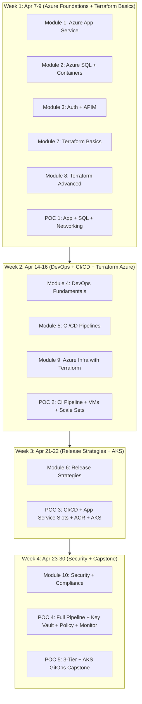
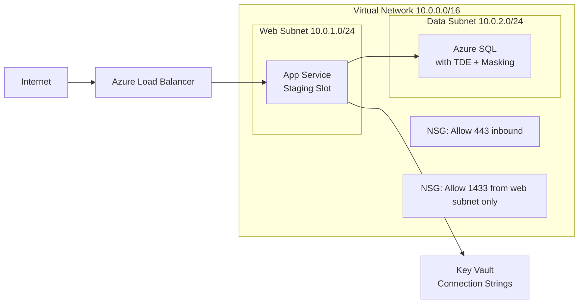
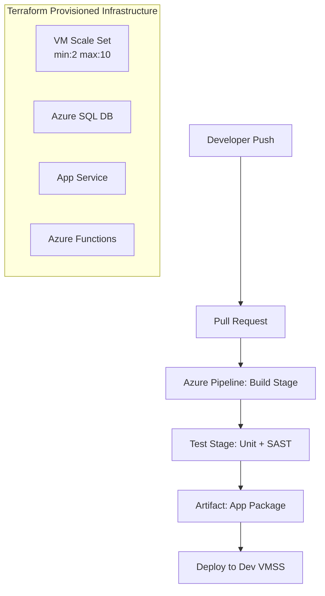
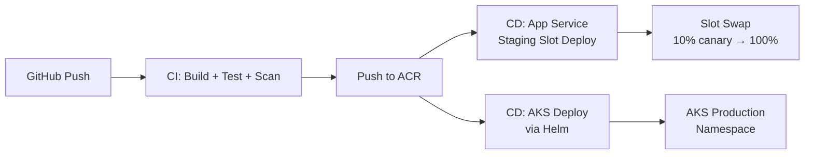
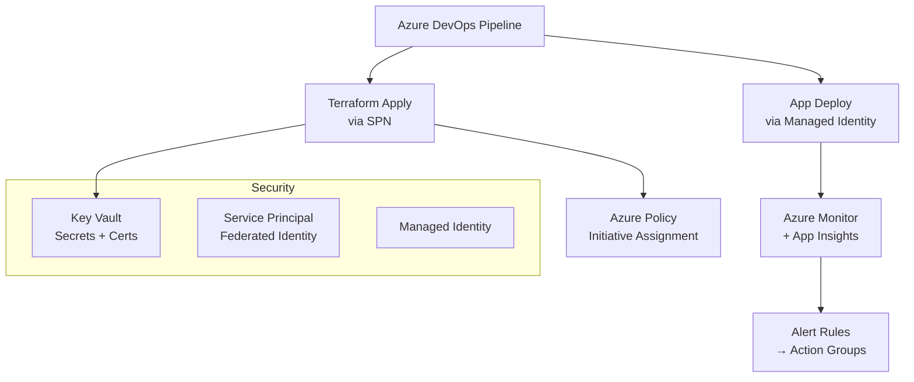
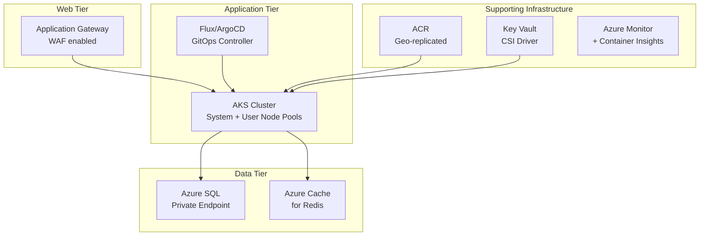

# Design Document

## Azure DevOps and Terraform Enterprise Training Program

---

## Overview

This design describes the complete architecture and structure of a 24-day enterprise training program running April 7–30, 2026. The program prepares a team for client interviews and real-world enterprise engagements through 12 learning modules, 5 integrated POCs, problem statements, interview preparation materials, and assessment frameworks.

The program is structured in two parallel tracks that converge in the final week:
- **Azure DevOps Track**: App Service → SQL/Containers → Auth/APIM → DevOps Fundamentals → CI/CD → Release Strategies → Security
- **Terraform Track**: Basics → Advanced → Azure Infrastructure → Security/Compliance

Each track feeds into progressively complex POCs, culminating in a capstone 3-tier + AKS GitOps deployment.

---

## Architecture

### Program Architecture Overview



### Content Delivery Architecture

Each learning module follows a consistent 3-layer structure:

```
Learning Module
├── Theory Layer
│   ├── Concept explanations with diagrams
│   ├── Azure service deep-dives
│   ├── Best practices and anti-patterns
│   └── Decision frameworks
├── Problem Statement Layer
│   ├── Enterprise Scenario A (primary)
│   ├── Enterprise Scenario B (secondary)
│   └── Discussion questions
└── POC Layer
    ├── Architecture diagram
    ├── Step-by-step implementation guide
    ├── Code / Terraform / Pipeline definitions
    ├── Validation checklist
    └── Interview Q&A
```

---

## Components and Interfaces

### Module Design Specification

Each of the 12 modules is designed with the following components:

#### Module 1: Azure App Service (Apr 7)

**Theory Content:**
- App Service Plans: tiers (Free, Basic, Standard, Premium, Isolated), scaling units
- Web Apps: runtime stacks, configuration, application settings, connection strings
- Azure Functions: consumption vs. premium plan, triggers, bindings, Durable Functions
- Deployment Slots: staging, production, swap mechanics, slot-specific settings
- Auto-scaling: metric-based rules, schedule-based rules, scale-out vs. scale-up

**Problem Statements:**
1. *E-commerce Platform Migration*: A retail client needs to migrate a .NET web app to Azure App Service with zero-downtime deployments, auto-scaling for seasonal traffic spikes (10x normal load), and a staging environment for QA validation before production releases.
2. *Serverless Order Processing*: A logistics company needs Azure Functions to process order events from a queue, with retry logic, dead-letter handling, and monitoring dashboards.

**POC Design (feeds into POC 1):**
- Web app deployment with deployment slots (staging → production swap)
- Connection string management via App Settings (not hardcoded)
- Auto-scale rule: scale out when CPU > 70% for 5 minutes, scale in when CPU < 30%
- Slot swap with traffic routing (10% canary to staging slot)

---

#### Module 2: Azure SQL + Containers (Apr 8)

**Theory Content:**
- Azure SQL Database: service tiers (DTU vs. vCore), elastic pools, serverless
- High Availability: geo-replication, failover groups, zone redundancy
- Security: TDE (Transparent Data Encryption), Always Encrypted, Dynamic Data Masking
- Backup: automated backups, point-in-time restore, long-term retention
- Azure Container Registry (ACR): SKUs, geo-replication, webhooks, tasks
- Azure Container Instances (ACI): use cases, resource limits, networking
- Azure Container Apps: environments, revisions, scaling rules, Dapr integration
- Decision matrix: ACI vs. Container Apps vs. AKS

**Problem Statements:**
1. *Financial Data Platform*: A bank needs a SQL database with encryption at rest, dynamic masking for PII (SSN, credit card), geo-replication to a secondary region, and automated compliance reporting.
2. *Microservices Containerization*: A SaaS company needs to containerize 5 microservices, store images in a private registry, and deploy them as a scalable container application with traffic splitting between revisions.

**POC Design (feeds into POC 1):**
- Azure SQL with TDE, Dynamic Data Masking on email/phone columns
- Failover group between primary and secondary regions
- ACR with geo-replication, image build task on git push
- Container App with two revisions, 20/80 traffic split

---

#### Module 3: Auth + API Management (Apr 9)

**Theory Content:**
- Microsoft Identity Platform: app registrations, service principals, OAuth 2.0 flows
- Azure Key Vault: secrets, keys, certificates; access policies vs. RBAC
- Managed Identities: system-assigned vs. user-assigned, use cases
- RBAC: built-in roles, custom roles, scope hierarchy (management group → subscription → RG → resource)
- Azure API Management: tiers, gateway, developer portal, policies
- APIM Policies: inbound/outbound/backend/on-error, rate limiting, caching, JWT validation
- API versioning: URL path, query string, header-based

**Problem Statements:**
1. *Zero-Trust API Gateway*: An enterprise needs an API gateway that validates JWT tokens, enforces rate limits per subscription, transforms request/response payloads, and provides a developer portal for partner onboarding.
2. *Secrets-Free Application*: A DevOps team needs to eliminate all hardcoded credentials from their application by using Managed Identities to access Key Vault, SQL Database, and Storage Account.

**POC Design (feeds into POC 4):**
- App registration with client credentials flow
- Key Vault with RBAC, Managed Identity access
- APIM with rate-limit policy (100 calls/minute), JWT validation policy, response caching
- Developer portal with product and subscription configuration

---

#### Module 4: DevOps Fundamentals (Apr 14)

**Theory Content:**
- Agile methodologies: Scrum, Kanban, SAFe; Azure Boards integration
- Git workflows: trunk-based development, GitFlow, GitHub Flow
- Branch policies: required reviewers, build validation, comment resolution
- Pull request automation: auto-complete, auto-merge, PR templates
- Technical debt: identification, measurement (code coverage, complexity), remediation strategies
- DevOps culture: CALMS framework, psychological safety, blameless post-mortems

**Problem Statements:**
1. *Enterprise Git Governance*: A 50-developer team needs a Git branching strategy that prevents direct commits to main, enforces code reviews, runs automated tests on every PR, and maintains a clean commit history.
2. *Technical Debt Reduction Sprint*: A team has accumulated significant technical debt. Design a process to identify, prioritize, and systematically reduce debt while continuing feature development.

**POC Design (feeds into POC 2):**
- Azure DevOps project with Boards, Repos, Pipelines
- Branch policies: require 2 reviewers, build validation pipeline, no direct push to main
- PR template with checklist (tests passing, docs updated, security reviewed)
- Work item linking to commits and PRs

---

#### Module 5: CI/CD Pipelines (Apr 15-16)

**Theory Content:**
- Azure Pipelines YAML: stages, jobs, steps, templates, extends
- Pipeline triggers: CI triggers, PR triggers, scheduled triggers, pipeline triggers
- Variables and variable groups: runtime variables, secret variables, variable templates
- Environments and approvals: deployment jobs, environment checks, approval gates
- GitHub Actions: workflow syntax, jobs, steps, marketplace actions, reusable workflows
- Artifact management: publish/download artifacts, Universal Packages, Container Registry
- Quality gates: test result publishing, code coverage thresholds, security scan gates

**Problem Statements:**
1. *Multi-Stage Enterprise Pipeline*: A team needs a pipeline that builds a .NET application, runs unit tests, performs SAST scanning, publishes artifacts, deploys to dev/staging/prod with approval gates, and sends notifications on failure.
2. *GitHub Actions Migration*: A team using Jenkins needs to migrate to GitHub Actions, maintaining all existing quality gates, test integrations, and deployment approvals.

**POC Design (feeds into POC 2 and POC 3):**
- Azure Pipelines YAML: 3-stage pipeline (Build → Test → Deploy)
- Pipeline template for reusable build steps
- Variable groups for environment-specific configuration
- GitHub Actions workflow with matrix strategy for multi-environment testing
- Approval gate before production deployment

---

#### Module 6: Release Strategies (Apr 21-22)

**Theory Content:**
- Blue-Green deployment: slot mechanics, DNS switching, database migration considerations
- Canary deployment: traffic splitting percentages, metric collection, automated rollback triggers
- A/B testing: hypothesis definition, metric selection, statistical significance
- Feature flags: LaunchDarkly/Azure App Configuration, flag lifecycle, kill switches
- Rollback strategies: automated rollback triggers, manual rollback procedures, data rollback
- Deployment rings: ring 0 (internal) → ring 1 (early adopters) → ring 2 (general availability)

**Problem Statements:**
1. *Zero-Downtime Production Release*: A financial services client needs to deploy a critical payment processing update with zero downtime, the ability to instantly rollback if error rates exceed 0.1%, and gradual traffic shifting from 5% → 25% → 100%.
2. *Feature Flag Governance*: A product team wants to decouple feature releases from code deployments, enabling A/B testing of new UI features and instant kill switches for problematic features.

**POC Design (feeds into POC 3):**
- Blue-green with App Service slots: staging slot receives 100% traffic, swap to production
- Canary: 10% → 50% → 100% traffic shift with Application Insights monitoring
- Azure App Configuration for feature flags with .NET SDK integration
- Automated rollback pipeline triggered by Application Insights alert

---

#### Module 7: Terraform Basics (Apr 7-8)

**Theory Content:**
- HCL syntax: blocks, arguments, expressions, comments
- Terraform providers: AzureRM provider, authentication methods (service principal, managed identity)
- Core workflow: `terraform init`, `plan`, `apply`, `destroy`, `fmt`, `validate`
- State management: local state, remote state, state locking, state manipulation
- Resource dependencies: implicit (reference) vs. explicit (`depends_on`)
- Lifecycle meta-arguments: `create_before_destroy`, `prevent_destroy`, `ignore_changes`
- Remote backends: Azure Storage backend configuration, state locking with blob leases

**Problem Statements:**
1. *Infrastructure Bootstrapping*: A new project needs foundational Azure infrastructure (resource group, storage account, virtual network with subnets, NSGs) provisioned consistently across dev/staging/prod environments using Terraform.
2. *State Management Migration*: A team using local Terraform state needs to migrate to remote state in Azure Storage with state locking to enable team collaboration.

**POC Design (feeds into POC 1):**
- Resource Group, Storage Account, VNet with 3 subnets, NSG with rules
- Azure Storage backend for remote state with state locking
- `terraform.tfvars` for environment-specific values
- `terraform plan` output review and `apply` with auto-approve in CI

---

#### Module 8: Terraform Advanced (Apr 9, 14)

**Theory Content:**
- Modules: module structure (`main.tf`, `variables.tf`, `outputs.tf`, `README.md`), module registry
- Dynamic blocks: `for_each` on blocks, `content` block, use cases (NSG rules, tags)
- Terraform functions: `toset()`, `tomap()`, `flatten()`, `merge()`, `lookup()`, `format()`, `file()`, `templatefile()`
- Data sources: `azurerm_resource_group`, `azurerm_subscription`, `azurerm_client_config`
- Locals: computed values, reducing repetition
- Provisioners: `local-exec`, `remote-exec`, when to avoid them
- `count` vs. `for_each`: trade-offs, index stability

**Problem Statements:**
1. *Reusable Module Library*: A platform team needs to create a library of Terraform modules for common Azure patterns (networking, compute, database) that application teams can consume with minimal configuration.
2. *Dynamic NSG Rule Management*: A security team needs to manage 50+ NSG rules across multiple environments using a single Terraform configuration with dynamic blocks driven by a variable map.

**POC Design (feeds into POC 2):**
- Networking module: VNet + subnets + NSGs with dynamic rules from variable map
- Compute module: VM or App Service with configurable parameters
- `for_each` on a map of environments to create multiple resource groups
- Data source to reference existing resources (existing VNet, existing Key Vault)

---

#### Module 9: Azure Infrastructure with Terraform (Apr 15, 21-22)

**Theory Content:**
- Virtual Machines: `azurerm_linux_virtual_machine`, custom images, extensions
- Virtual Machine Scale Sets: `azurerm_linux_virtual_machine_scale_set`, autoscale profiles
- AKS: `azurerm_kubernetes_cluster`, node pools, CNI networking, RBAC, monitoring add-on
- Networking: VNet, subnets, NSG, Application Gateway, Azure Load Balancer, Private Endpoints
- Security resources: Key Vault, Managed Identity, role assignments with `azurerm_role_assignment`
- 3-tier architecture pattern: web tier (App Gateway) → app tier (VMSS/AKS) → data tier (SQL)

**Problem Statements:**
1. *Enterprise AKS Platform*: A company needs an AKS cluster with system and user node pools, Azure CNI networking, Azure AD integration, Container Insights monitoring, and private API server endpoint.
2. *Auto-Scaling Web Tier*: A high-traffic application needs a VMSS-based web tier with custom scaling rules, load balancer health probes, and automatic OS image updates.

**POC Design (feeds into POC 3 and POC 5):**
- AKS cluster: system node pool + user node pool, Azure CNI, RBAC enabled, Container Insights
- VMSS with autoscale: scale out at 70% CPU, scale in at 30% CPU, min 2 / max 10 instances
- Application Gateway as ingress for AKS
- Private endpoint for Azure SQL

---

#### Module 10: Security and Compliance (Apr 23, 28-30)

**Theory Content:**
- Secure DevOps: shift-left security, OWASP Top 10, threat modeling
- Security scanning: Trivy (container), Checkov (IaC), OWASP ZAP (DAST), SonarQube (SAST)
- Azure Monitor: Log Analytics workspace, diagnostic settings, workbooks
- Application Insights: instrumentation, distributed tracing, availability tests, smart detection
- Azure Policy: built-in policies, custom policies, initiatives, compliance reporting
- Azure Defender for Cloud: security score, recommendations, regulatory compliance
- Compliance frameworks: SOC 2 Type II controls mapping, ISO 27001, GDPR data residency

**Problem Statements:**
1. *Secure CI/CD Pipeline*: A financial services client requires all pipelines to include dependency vulnerability scanning, IaC security scanning, SAST analysis, and container image scanning before any deployment to production.
2. *Governance at Scale*: A company with 20 Azure subscriptions needs Azure Policy to enforce tagging standards, allowed regions, required diagnostic settings, and prohibited resource types across all subscriptions.

**POC Design (feeds into POC 4 and POC 5):**
- Pipeline with Trivy, Checkov, and SonarQube stages
- Azure Policy initiative: require tags, allowed locations, require diagnostic settings
- Log Analytics workspace with diagnostic settings for all resources
- Application Insights with availability test and alert rules
- Defender for Cloud with regulatory compliance dashboard

---

### POC Implementation Design

#### POC 1: App + SQL + Networking Foundation (Apr 7)

**Objective:** Deploy a web application connected to Azure SQL with complete networking foundation using Terraform.

**Architecture:**


**Deliverables:**
- Terraform: Resource Group, Storage Account (remote state), VNet, 3 subnets, NSGs, Load Balancer
- Terraform: Azure SQL with TDE, Dynamic Data Masking, failover group
- Azure DevOps: App Service with staging slot, connection string from Key Vault
- Validation: App returns 200, SQL connection works, masked data visible in query

---

#### POC 2: CI Pipeline + VMs + Scale Sets (Apr 14)

**Objective:** Implement a CI pipeline that builds and tests a web app, and provision compute infrastructure with Terraform.

**Architecture:**


**Deliverables:**
- Terraform modules: networking module, compute module (VMSS), database module
- Azure Pipelines YAML: build → test → artifact → deploy stages
- Branch policies: require PR, build validation, 1 reviewer
- Validation: pipeline runs green, VMSS scales, app deploys successfully

---

#### POC 3: CI/CD + App Service Slots + ACR + AKS (Apr 21)

**Objective:** Full CI/CD pipeline deploying to App Service with deployment slots and AKS via ACR.

**Architecture:**


**Deliverables:**
- Multi-stage Dockerfile with ACR build task
- Azure Pipelines: CI stage + CD stage with slot swap and AKS deploy
- Terraform: AKS cluster, ACR, App Service with slots
- Canary: Application Insights alert → automated rollback pipeline
- Validation: image in ACR, app in staging slot, AKS pods running, canary traffic split working

---

#### POC 4: Full Pipeline + Key Vault + SPN + Policy + Monitor (Apr 28)

**Objective:** Enterprise-grade pipeline with security, governance, and observability.

**Architecture:**


**Deliverables:**
- Service Principal with federated credentials (OIDC) for Terraform
- Key Vault with RBAC, pipeline accesses secrets via Managed Identity
- Azure Policy initiative: tagging, regions, diagnostic settings
- Log Analytics + Application Insights + alert rules
- Validation: pipeline runs with no stored credentials, policy compliance 100%, alerts fire on test

---

#### POC 5: 3-Tier Architecture + AKS GitOps Capstone (Apr 29-30)

**Objective:** Complete enterprise 3-tier architecture with AKS GitOps workflow as capstone demonstration.

**Architecture:**


**Deliverables:**
- Terraform: complete 3-tier infrastructure (App Gateway, AKS, SQL, Redis, ACR, Key Vault)
- GitOps: Flux or ArgoCD installed on AKS, syncing from Git repo
- Helm charts for application deployment
- Azure Pipelines: infrastructure pipeline (Terraform) + application pipeline (build → push → GitOps sync)
- Validation: end-to-end request flow, GitOps sync working, monitoring dashboards populated

---

## Data Models

### Training Schedule Data Model

```
TrainingDay {
  date: Date                    // Apr 7-30, 2026 (weekdays only)
  modules: Module[]             // 1-2 modules per day
  poc: POC | null               // POC exercise if applicable
  objectives: string[]          // Daily learning outcomes
  duration_hours: number        // Total hours for the day
}

Module {
  id: string                    // e.g., "M1", "M7"
  title: string
  track: "azure-devops" | "terraform"
  theory_hours: number
  practice_hours: number
  prerequisites: Module[]
  problem_statements: ProblemStatement[]
  assessment: Assessment
}

ProblemStatement {
  id: string                    // e.g., "PS1-A", "PS1-B"
  title: string
  business_context: string
  technical_requirements: string[]
  constraints: string[]
  success_criteria: string[]
  azure_services: AzureService[]
}

POC {
  id: string                    // e.g., "POC1"
  date: Date
  modules_covered: Module[]
  architecture_diagram: string  // Mermaid diagram
  deliverables: Deliverable[]
  validation_checklist: ValidationItem[]
  estimated_hours: number
}
```

### Assessment Data Model

```
Assessment {
  module_id: string
  knowledge_checks: Question[]   // Theory questions
  practical_tasks: Task[]        // Hands-on validation
  rubric: RubricCriteria[]
}

RubricCriteria {
  criterion: string
  weight: number                 // percentage
  levels: {
    exemplary: string            // 4 points
    proficient: string           // 3 points
    developing: string           // 2 points
    beginning: string            // 1 point
  }
}
```

### Interview Preparation Data Model

```
InterviewQuestion {
  module_id: string
  type: "conceptual" | "scenario" | "troubleshooting" | "design"
  question: string
  sample_answer: string
  follow_up_questions: string[]
  evaluation_criteria: string[]
}
```

---

## Correctness Properties

*A property is a characteristic or behavior that should hold true across all valid executions of a system — essentially, a formal statement about what the system should do. Properties serve as the bridge between human-readable specifications and machine-verifiable correctness guarantees.*


### Property 1: Module Structural Completeness

*For any* learning module in the training program, the module SHALL contain all required structural components: a non-empty title, theory content, at least one practical example, at least one hands-on exercise, and consistent section formatting matching the program's module schema.

**Validates: Requirements 1.2, 1.4**

---

### Property 2: Problem Statement Completeness

*For any* learning module in the training program, the module SHALL have at least 2 problem statements, and for any problem statement, it SHALL contain non-empty values for business_context, technical_requirements, constraints, and success_criteria.

**Validates: Requirements 2.1, 2.2**

---

### Property 3: Azure Service Specification in Problem Statements

*For any* problem statement that references one or more Azure services, each referenced service SHALL have associated service tier, scaling requirements, and cost considerations specified.

**Validates: Requirements 2.4**

---

### Property 4: POC-to-Problem-Statement Coverage

*For any* problem statement defined in the training program, there SHALL exist a corresponding POC exercise that provides step-by-step implementation guidance addressing that problem statement's technical requirements.

**Validates: Requirements 3.1**

---

### Property 5: POC Artifact Completeness

*For any* POC in the training program, the POC SHALL contain: working code or Terraform configurations, pipeline definitions, deployment scripts, a validation checklist with at least one item, and — when the POC involves more than one Azure service — a non-empty architecture diagram.

**Validates: Requirements 3.2, 3.4, 3.5**

---

### Property 6: Interview Materials Completeness

*For any* learning module in the training program, the module SHALL have at least one interview question of type "scenario", all interview questions SHALL have non-empty sample_answer fields, and at least one question SHALL address cost optimization, security, or scalability trade-offs.

**Validates: Requirements 17.1, 17.2, 17.3, 17.5**

---

### Property 7: Assessment Completeness

*For any* learning module in the training program, the module SHALL have an assessment containing at least one theoretical knowledge check question and at least one practical skill demonstration task, with a rubric defining evaluation criteria.

**Validates: Requirements 20.1, 20.2**

---

### Property 8: Schedule Prerequisite Ordering

*For any* learning module in the training schedule that has one or more prerequisite modules, all prerequisite modules SHALL be scheduled on an earlier date than the dependent module.

**Validates: Requirements 21.5**

---

## Error Handling

### Content Gaps
- If a module is missing required sections, the trainer should flag it before delivery and fill gaps using the module template
- Missing problem statements should be escalated to the content owner; a placeholder with the required schema fields should be inserted

### POC Environment Failures
- Each POC includes a "prerequisites" section listing required Azure permissions, subscription quotas, and tooling versions
- If a POC step fails, the validation checklist identifies the expected state so the learner can diagnose the delta
- Terraform state corruption: documented recovery procedure using `terraform state` commands and Azure Storage blob snapshots

### Schedule Slippage
- Each day has a "core" set of objectives (must complete) and "stretch" objectives (complete if time allows)
- If a module runs over time, the stretch objectives are deferred to the next available buffer slot
- Apr 10-11, 17-18, 24-25 are weekends (no sessions); Apr 28-30 has built-in buffer for catch-up

### Assessment Failures
- Learners who do not meet the proficiency threshold (score < 3/4 on rubric) are given targeted remediation exercises
- Remediation focuses on the specific criteria where the learner scored below proficient

---

## Testing Strategy

### Overview

This training program is a content and curriculum artifact, not a software application. The primary "tests" are structural validation of the program's data model and content completeness checks. Property-based testing applies to the structural invariants of the program's content model.

### Property-Based Testing

**Library**: [fast-check](https://github.com/dubzzz/fast-check) (TypeScript/JavaScript) or [hypothesis](https://hypothesis.readthedocs.io/) (Python), depending on the tooling used to generate/validate program content.

**Minimum iterations**: 100 per property test.

Each property test is tagged with:
`// Feature: azure-devops-terraform-training-program, Property {N}: {property_text}`

**Property Tests to Implement:**

| Property | Test Description | Generator |
|---|---|---|
| P1: Module Structural Completeness | Generate arbitrary module objects; verify all required fields are present and non-empty | Arbitrary module with random content |
| P2: Problem Statement Completeness | For each module, verify ≥2 problem statements each with all required fields | Arbitrary module with 0-5 problem statements |
| P3: Azure Service Specification | For problem statements with Azure services, verify tier/scaling/cost fields | Arbitrary problem statement with 0-5 services |
| P4: POC Coverage | For each problem statement, verify a corresponding POC exists | Arbitrary program with N problem statements |
| P5: POC Artifact Completeness | For each POC, verify all artifact fields and conditional diagram | Arbitrary POC with 1-5 services |
| P6: Interview Materials | For each module, verify scenario questions and sample answers | Arbitrary module with 0-10 questions |
| P7: Assessment Completeness | For each module, verify knowledge checks and practical tasks | Arbitrary module assessment |
| P8: Schedule Ordering | For any schedule, verify prerequisites always precede dependents | Arbitrary schedule permutation |

### Unit Tests (Example-Based)

- Verify the program contains exactly 12 modules with the correct topic names (Req 1.1)
- Verify the schedule spans April 7–30, 2026 with correct weekday count (Req 21.1)
- Verify POC 5 (capstone) references all 5 POC deliverable categories (Req 16)
- Verify each of the 5 POCs has an architecture diagram (Req 3.4)

### Integration / Manual Validation

- **POC Smoke Tests**: Each POC includes a validation checklist that serves as a manual integration test. Learners run `terraform plan`, check pipeline runs, and verify Azure portal state.
- **Content Review**: Subject matter expert review of problem statements for realism (Req 2.3) and best practices coverage (Req 3.3, 18.1)
- **Schedule Feasibility Review**: Trainer dry-run of each day's content to validate time estimates

### Validation Scripts

Each POC includes a validation script (`validate.sh` or `validate.ps1`) that checks:
1. Required Azure resources exist (using `az` CLI)
2. Resources have correct configuration (tags, SKUs, settings)
3. Application endpoints return expected HTTP status codes
4. Pipeline last run status is successful

Example validation script structure:
```bash
#!/bin/bash
# POC 1 Validation Script
# Feature: azure-devops-terraform-training-program

echo "=== POC 1 Validation ==="

# Check Resource Group
az group show --name "rg-poc1-training" --query "properties.provisioningState" -o tsv

# Check App Service is running
az webapp show --name "app-poc1-training" --resource-group "rg-poc1-training" \
  --query "state" -o tsv

# Check SQL Database
az sql db show --name "sqldb-poc1" --server "sql-poc1-training" \
  --resource-group "rg-poc1-training" --query "status" -o tsv

# Check deployment slot exists
az webapp deployment slot list --name "app-poc1-training" \
  --resource-group "rg-poc1-training" --query "[].name" -o tsv

echo "=== Validation Complete ==="
```

---

## Training Schedule

### April 2026 Schedule

| Date | Day | Modules | POC | Focus |
|---|---|---|---|---|
| Apr 7 | Mon | M1: App Service + M7: Terraform Basics | POC 1 (start) | Azure foundations + IaC basics |
| Apr 8 | Tue | M2: SQL + Containers + M7: Terraform Basics (cont.) | POC 1 (complete) | Data + containers + remote state |
| Apr 9 | Wed | M3: Auth + APIM + M8: Terraform Advanced | — | Security + advanced IaC |
| Apr 14 | Mon | M4: DevOps Fundamentals + M8: Terraform Advanced (cont.) | POC 2 (start) | DevOps culture + modules |
| Apr 15 | Tue | M5: CI/CD Pipelines + M9: Azure Infra with Terraform | POC 2 (complete) | Pipelines + compute IaC |
| Apr 16 | Wed | M5: CI/CD Pipelines (cont.) | — | Multi-stage pipelines deep dive |
| Apr 21 | Mon | M6: Release Strategies + M9: Azure Infra (cont.) | POC 3 (start) | Deployment patterns + AKS |
| Apr 22 | Tue | M6: Release Strategies (cont.) | POC 3 (complete) | Canary + feature flags |
| Apr 23 | Wed | M10: Security + Compliance | — | Secure DevOps + scanning |
| Apr 28 | Mon | M10: Security (cont.) | POC 4 (start) | Governance + monitoring |
| Apr 29 | Tue | Capstone review + integration | POC 5 (start) | 3-tier architecture |
| Apr 30 | Wed | Capstone completion + interview prep | POC 5 (complete) | GitOps + final review |

### Daily Structure Template

Each training day follows this structure:
- **0:00–0:30** — Recap of previous session, Q&A
- **0:30–2:00** — Theory delivery with live demos
- **2:00–2:15** — Break
- **2:15–3:00** — Problem statement discussion and design exercise
- **3:00–5:00** — Hands-on POC implementation
- **5:00–5:30** — Validation, debrief, preview of next session

---

## Documentation Structure

The training program produces the following documentation artifacts:

```
training-program/
├── modules/
│   ├── 01-azure-app-service/
│   │   ├── theory.md
│   │   ├── problem-statements.md
│   │   ├── poc/
│   │   │   ├── README.md
│   │   │   ├── terraform/
│   │   │   ├── pipelines/
│   │   │   └── validate.sh
│   │   ├── assessment.md
│   │   └── interview-prep.md
│   ├── 02-azure-sql-containers/
│   │   └── ... (same structure)
│   └── ... (modules 03-10)
├── pocs/
│   ├── poc1-app-sql-networking/
│   ├── poc2-ci-pipeline-compute/
│   ├── poc3-cicd-slots-aks/
│   ├── poc4-security-governance/
│   └── poc5-3tier-gitops-capstone/
├── reference/
│   ├── terraform-cheatsheet.md
│   ├── azure-cli-cheatsheet.md
│   ├── architecture-patterns.md
│   └── decision-matrices.md
├── interview-prep/
│   ├── questions-by-module.md
│   └── scenario-bank.md
└── schedule.md
```

Each module directory follows the same structure to ensure consistency (Property 1).
